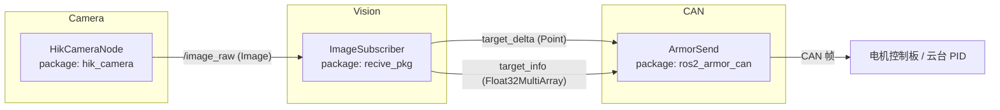
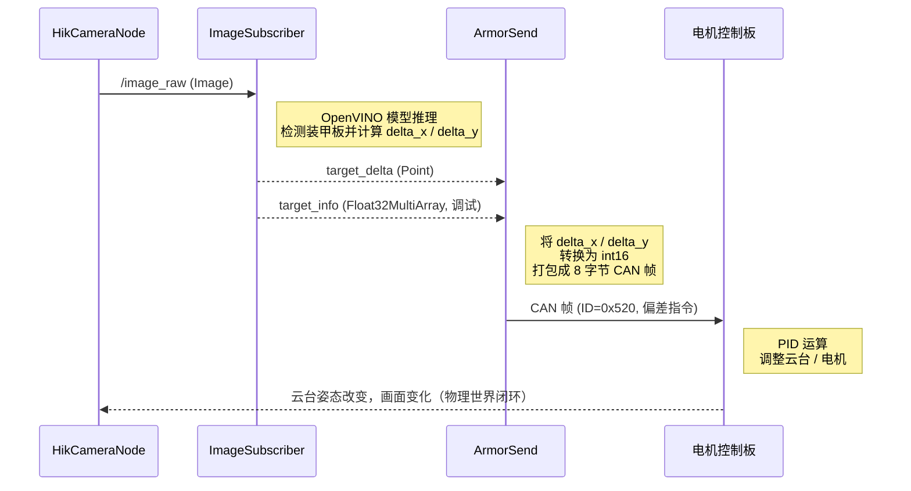

# 系统架构与信息流说明

本文档梳理本仓库中自瞄相关节点之间的**信息交换关系**和**处理流程**，帮助快速理解从相机到电机的整体闭环。

---

## 1. 模块与节点职责概览

- `hik_camera` 包
  - 节点：`HikCameraNode`
  - 作用：通过海康 SDK 采集图像，发布到 ROS2 话题 `/image_raw`。

- `recive_pkg` 包
  - 节点：`ImageSubscriber`（主程序入口在 `src/recive_pkg/main.cpp`）
  - 作用：订阅 `/image_raw`，调用 `rm_auto_aim/detection` 中的 OpenVINO 检测逻辑，计算装甲板偏差并发布。

- `rm_auto_aim/detection`
  - 作用：封装 OpenVINO 推理（`DetectionArmor` 等类）和离线测试程序 `test_aim_node`，不直接跑 ROS 节点，但被 `ImageSubscriber` 复用。

- `ros2_armor_can` 包
  - 节点：`ArmorSend`（可执行文件 `armor_send_node`）
  - 作用：订阅视觉节点输出的偏差信息，封装为 CAN 帧，经 `BMCANTool` 下发至电机控制板。

---

## 2. 节点-话题 拓扑关系

### 2.1 拓扑图（mermaid）

### 2.2 话题与消息定义

1. 相机输出
   - 话题：`/image_raw`
   - 类型：`sensor_msgs/msg/Image`（配套 `CameraInfo`）
   - 发布者：`HikCameraNode`（`hik_camera` 包）
   - 用途：为视觉节点提供实时 BGR8 图像。

2. 视觉检测输出（控制用）
   - 话题：`target_delta`
   - 类型：`geometry_msgs/msg/Point`
   - 发布者：`ImageSubscriber`（`recive_pkg` 包）
   - 含义：
     - `x`：目标在水平轴的偏差（像素或角度）
     - `y`：目标在垂直轴的偏差
     - `z`：当前固定为 `0.0`，预留扩展

3. 视觉检测输出（调试用）
   - 话题：`target_info`
   - 类型：`std_msgs/msg/Float32MultiArray`
   - 发布者：`ImageSubscriber`
   - 数据约定（长度 ≥ 6）：
     - `data[0], data[1]`：目标中心坐标
     - `data[2], data[3]`：光心坐标
     - `data[4], data[5]`：`delta_x, delta_y`（与 `target_delta` 中一致）

4. 电机控制输入
   - 订阅者：`ArmorSend` 节点（`armor_send_node` 可执行）
   - 订阅：
     - `target_delta`：用于生成控制量
     - `target_info`：用于日志打印与调试
   - 处理：
     - 将 `delta_x / delta_y` 转成 `int16`，按照协议打进 8 字节 CAN 帧，
       使用 `canbus.can_send(channelhandle, cantx_id, data, len)` 发送给电机板。

---

## 3. 单帧数据的时序流程

下面以“一帧画面从相机到电机”的路径来描述整个流程。

### 3.1 相机采集阶段（感知输入）

1. 启动 `hik_camera.launch.py`，创建 `HikCameraNode` 节点。
2. 节点使用海康 SDK：
   - 枚举设备、打开第一台相机；
   - 设置分辨率、曝光时间（`exposure_time`）、增益（`gain`）、帧率（`frame_rate`）等参数；
   - 获取图像基本信息，配置像素格式转换为 BGR8。
3. 开启采集线程：
   - 不断调用 `MV_CC_GetImageBuffer` 取帧；
   - 调用 `MV_CC_ConvertPixelType` 转为 BGR8；
   - 封装成 `sensor_msgs::msg::Image` 并发布到 `/image_raw`。

### 3.2 视觉检测阶段（目标识别与偏差计算）

1. 启动 `recive_pkg` 可执行（`recive_pkg`），创建 `ImageSubscriber` 节点：
   - 在构造函数中加载模型：`new.xml`（OpenVINO IR 模型）；
   - 订阅 `/image_raw`（QoS 使用 sensor_data 风格）。
2. 在 `imageCallback` 中：
   - 使用 `cv_bridge::toCvCopy` 将 ROS 图像转为 `cv::Mat`；
   - 调用 `detection::DetectionArmor::start_detection(image)` 运行 OpenVINO 推理；
   - 从检测结果中选取目标装甲板，读取目标中心、光心坐标；
   - 计算 `delta_x` / `delta_y`（目标相对光心的偏差）。
3. 节流发布：
   - 使用 `publish_interval_` 控制约 10 Hz 发布一次，避免控制频率过高；
   - 每次发布时：
     - 发布 `target_delta`（简洁控制接口）；
     - 发布 `target_info`（包含目标中心、光心与偏差，便于调试和日志分析）。
4. 可选：使用 `cv::imshow` 显示原始图像和检测结果，用于现场调参。

### 3.3 CAN 桥接与电机控制阶段（执行输出）

1. 通过 `ros2 launch ros2_armor_can motor_all.launch.py` 或 `bash launch_motor.sh` 启动 `armor_send_node`。
2. 节点初始化时：
   - 打开 CAN 通道：`canbus.open(channelhandle, "BM-CANFD-X1(5850)")`；
   - 检查句柄是否有效，准备发送数据。
3. 订阅 `target_delta`：
   - 在回调中读取偏差 `x, y`，打印日志；
   - 启动后台线程，调用 `send_motor_cmd(int16_t x, int16_t y, ...)`，避免阻塞 DDS 回调线程。
4. 订阅 `target_info`：
   - 解析出目标中心、光心和偏差，打印详细日志；
   - 同样在后台线程中调用 `send_motor_cmd`，保证实时性。
5. 在 `send_motor_cmd` 中：
   - 将偏差转换为 `int16`，按高/低字节填入 8 字节数组；
   - 调用 `canbus.can_send(channelhandle, cantx_id, can_send_data, len)` 下发到指定 CAN ID（如 `0x520`）。
6. 电机控制板端：
   - 接收 CAN 帧后，解算成目标偏差；
   - 通过 PID 控制更新云台/底盘电机，使装甲板逐渐对准光心。

### 3.4 闭环控制效果

- 相机不断采集 → 视觉不断输出偏差 → CAN 不断输出控制量 → 云台逐步对准目标。
- 当 `delta_x / delta_y` 接近 0 时，说明目标已对准，控制输出趋于平衡，系统闭环完成。

---

## 4. 离线检测流程（不走 ROS）

`rm_auto_aim/detection/test_aim_node.cpp` 提供了离线检测流程，用于单独验证模型性能：

1. 从 `video/` 目录扫描本地视频文件，用户选择一个进行测试；
2. 与在线节点共用同一个 OpenVINO 模型 `new.xml` 和 `DetectionArmor` 推理逻辑；
3. 在本地窗口显示检测结果、FPS 等信息，但**不发布 ROS 话题，也不发 CAN**。

用途：
- 在没有机器人、没有相机的环境下，对模型精度和性能做回放测试；
- 调参时可以复用相同视频，方便对比不同配置对检测质量的影响。

---

## 5. 启动顺序建议与排错思路

1. **基础环境准备**
   - `source /opt/ros/humble/setup.bash`
   - `source install/setup.bash`

2. **启动相机节点**
   - `ros2 launch hik_camera hik_camera.launch.py`
   - 用 `rqt_image_view` 或 `ros2 topic echo /image_raw` 验证图像流是否正常。

3. **启动视觉检测节点**
   - `ros2 run recive_pkg recive_pkg`
   - 用 `ros2 topic echo target_delta` 和 `target_info` 检查是否有稳定输出。

4. **启动 CAN 桥接节点**
   - `bash launch_motor.sh` 或
   - `ros2 launch ros2_armor_can motor_all.launch.py`
   - 观察日志中 CAN 发送情况，确认通道已打开且无错误返回码。

5. 若闭环有问题，可按以下顺序排查：
   - `/image_raw` 是否有图像；
   - `target_delta` 是否有连续更新且数值合理；
   - CAN 发送日志是否正常、返回码是否为 0；
   - 检查电机板侧的 CAN 抓包与 PID 参数配置。

